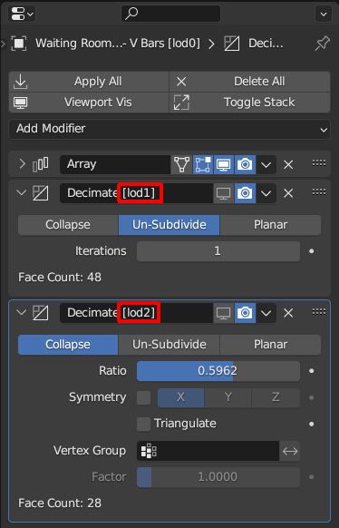
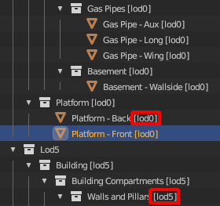
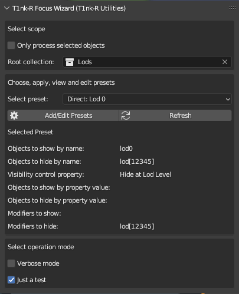
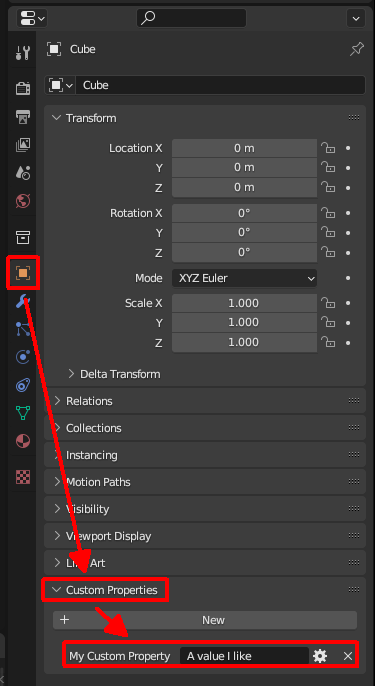
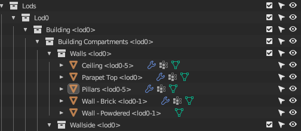
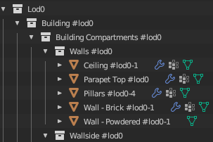
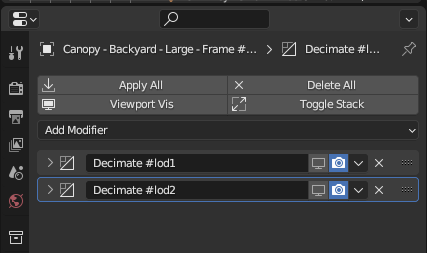

# T1nk-R Focus Wizard add on for Blender

Part of **T1nk-R Utilities for Blender**

## TL;DR

You can use this add-on to create presets in the form of a set of rules:

* to control the visibility of Blender objects based on object name patterns and custom object property value patterns, as well as
* to control the visibility of object modifiers based on modifier name patterns.

With this add-on you can set up rules to easily view your model as it looks like at various LOD levels by showing respective objects and modifier effects and hiding others.

This quick demo shows how easy it can be to switch between views for various lod levels of your models no matter how complex they are.

https://github.com/gusztavj/Focus-Wizard/assets/12009110/52c55d88-da66-429c-b061-b6850398fc3d

You need Blender 3.6 or newer for this add-on to work:

Help, support, updates and anything else: [https://github.com/gusztavj/Focus-Wizard](https://github.com/gusztavj/Focus-Wizard)

## Legal Stuff

### Copyright

This add-on has been created by [T1nk-R (https://github.com/gusztavj/)]((https://github.com/gusztavj/)).

**Creative Commons CC BY-NC-SA:**

* This license enables re-users to distribute, remix, adapt, and build upon the material in any medium or format for noncommercial purposes only, and only so long as attribution is given to the creator.
* If you remix, adapt, or build upon the material, you must license the modified material under identical terms.

* CC BY-NC-SA includes the following elements:

  * BY: credit must be given to the creator.

    Credit text:
    > Original addon created by: T1nk-R - [janvari.gusztav@imprestige.biz](mailto:janvari.gusztav@imprestige.biz) / [https://github.com/gusztavj](https://github.com/gusztavj)

  * NC: Only noncommercial uses of the work are permitted.
  * SA: Adaptations must be shared under the same terms.

**For commercial use**, please contact me via [janvari.gusztav@imprestige.biz](janvari.gusztav@imprestige.biz). Don't be scared of
rigid contracts and high prices, above all I just want to know if this work is of your interest, and discuss options for commercial support and other services you may need.

Version: Please see the `version` tag under `bl_info` in `__init__.py`.

### Disclaimer

This add-on is provided as-is. Use at your own risk. No warranties, no guarantee, no liability, no matter what happens. Still I tried to make sure no weird things happen:

* This add-on is intended to show or hide objects under the collection you specified as the scope of operation.
* This add-on is intended to show or hide modifier effects of objects under the collection you specified as the scope of operation.
* This add-on is not intended to modify your objects and other Blender assets in any other way. In particular, this add-on is not intended to anyhow touch objects out of the scope you selected as the scope of operation.
* You shall be able to simply undo consequences made by this add-on.
* You can use this add-on to save your presets in JSON format to a file on your computer.
* You can use this add-on to load presets from a JSON file on your computer.

You may learn more about legal matters on page [https://github.com/gusztavj/Focus-Wizard](https://github.com/gusztavj/Focus-Wizard).

## Quick Intro

### What to Do With This Stuff?

When creating assets for games, you often need to take care of various versions of your model for various detail levels, called LOD (level of details). The most detailed version is usually called lod0, while lod1, lod2 etc. are each less detailed.

There are multiple approaches on how to create these less detailed versions. Common to many is, however, that for moderately and largely complex models, it may be cumbersome, time-consuming and error-prone to display your model as it looks at a specific lod level or to export it to files for game engines:

* If you apply object modifiers to decimate your objects, to switch lod levels, you may need to select each of your objects one by one and set the visibility of the effects of the modifiers in the viewport carefully.
* If you create multiple versions with different levels of details of your objects, it may also be time-consuming to find which ones to display and which ones to hide, especially if there are some objects that would be great for multiple lod levels.

This add-on can help turning this nightmare into a seamless experience by offering (and letting you create) presets defining what to display. Presets include rules:

* to specify which objects to show or hide
  * based on object name patterns and
  * value patterns of custom object properties, and
* to specify which object modifiers to show/hide in the viewport based on the name pattern of modifiers.

#### Quick Examples

##### Quick Example 1

For example, if you tag your modifiers to include the lod level for which to apply them in the form of `[lodx]` (with `x` going from 0 to e.g. 4), you can specify a preset for LOD 3 which shows all modifiers the name of which contain `[lod3]` and hide all others.

||
|:--:|
|_Modifiers tagged to indicate for which LOD you want to use them_|

##### Quick Example 2

You tag your objects the same way. You can then specify a preset for LOD 2 to show only objects with `[lod2]` in the name.

||
|:--:|
|_Objects tagged to indicate for which LOD you want to use them_|

##### Quick Example 3 (Tutorial)

This add-on is shipped with an example Blender model file that you can find in the `example` folder of the ZIP file of the installation package, or under the installation folder of the add-on. The example is accompanied by a [Tutorial](example/README.md).

### Using T1NK-R Focus Wizard

To make use of this add-on, you have to do some homework: you either need to learn about the built-in presets and adjust your modeling techniques to make use of them, or you need to learn about creating presets and create them to reflect how you manage your stuff. Learning may cost some time and experimenting, however it will pay off: you'll be able to switch between various views with a single click. If you are even now able to easily switch between views of various LOD levels, please let me know, I'm interested in your modeling techniques and lod development pipeline.

Don't be too scared now, to make a preset you only need to compose a few not too complex regular expressions (regex). You can always use the built-in ones as guides and hints.

Next you have to tag your objects and modifiers properly. How to tag them depends on the presets you use or create.

To get started, open the **Sidebar** (hit **N**) in **Object Mode** in the viewport after you enabled the add-on. You'll see something like this:

||
|:--:|
|_Screenshot of the main panel of the add-on_|

The main panel of the Focus Wizard is divided into the following sections:

* In the top section you can [select the scope of your operations](#scope-selector).
* In the [middle section](#preset-selector-and-info) you can select a preset, view it's rules, as well as access the [Preset Editor](#preset-editor) window.
* By the end you can set various [operation parameters](#operation-settings).

Once properly set up and got used to it, most of the time you will only switch between presets.

## Understanding Presets

Presets, sets of rules, describe what objects you want to make visible and which objects you want to make hidden, as well as which modifiers to make visible or hidden for any LOD level.

### Anatomy of Presets

A preset is a set of rules and some accompanying properties:

* **Preset Name** is the unique name and identifier of the preset.
  > Make sure preset names are unique as they serve as the keys of presets, too. If you have two presets by the same name, it is undefined which one will be in effect.

* **Built-In** (not directly visible) tells whether it's a built-in effect or not. You cannot edit the name of built-in presets and cannot delete built-in presets.

* **Objects by name** group of rules can be used to determine object visibility based on object names:
  
  * **Show Objects by Name**. A regex pattern. Objects with names matching this regex will be made **visible**.
    * If the regex is empty, all objects (within the scope) will be made visible.
  
  * **Hide Objects by Name**. A regex pattern. Objects with names matching this regex will be made **hidden**.
    * If the regex is empty, this rule won't make any objects hidden.

* **Objects by property value** group of rules can be used to determine object visibility based on custom object property values:
  
  * **Custom Property Name**. The name of a [custom object property](#rules-based-on-custom-object-properties). If you define a pattern for **Show Objects by Property Value** or **Hide Objects by Property Value**, the add-on will check the value of the property you specified here.
  
  * **Show Objects by Property Value**. A regex pattern. Objects to which the specified custom object property has been added with a value matching this regex will be made **visible**.
    * If the regex is empty, this rule won't have any effect.
  
  * **Hide Objects by Property Value**. A regex pattern. Objects to which the specified custom object property has been added with a value matching this regex will be made **hidden**.
    * If the regex is empty, this rule won't have any effect.

* **Modifiers** group of rules can be used to determine modifier visibility based on modifier names:
  
  * **Modifiers to Show.** A regex pattern. Only objects made visible by the **Objects by name** or **Objects by property value** group of rules will be considered. If the name of a modifier matches this regex, that modifier will be made **visible** in the viewport.
    * If the regex is empty, this rule won't have any effect.
  
  * **Modifiers to Hide.** A regex pattern. Only objects made visible by the **Objects by name** or **Objects by property value** group of rules will be considered. If the name of a modifier matches this regex, that modifier will be made **hidden** in the viewport.
    * If the regex is empty, this rule won't have any effect.

### Rules based on custom object properties

You can control object visibility based on custom object properties. This enables you to follow a scenario where you add a specific custom object property to objects that you want to hide or display at certain LOD levels.

You can easily add and manage custom object properties using [T1nk-R Custom Object Property Manager](https://github.com/gusztavj/Custom-Object-Property-Manager), another member of the **T1nk-R Utilities**, designed specifically for this purpose.

To locate custom object properties after selecting an object in Blender:

1. Find or open a **Properties** editor.
1. Click **Object**.
1. Scroll down to and expand **Custom properties**.

||
|:--:|
|_Accessing and viewing an object's custom properties in Blender_|

You can use any name allowed by Blender for you custom object properties.

The simplest way is to create a string property named, for example, `Hide at Lod Level`, and set it to `n` (where `n` is a number) for an object if you don't need that object at lod level `n` and less-detailed levels. If you don't need to show the object from lod 3, enter `3`. This is how the built-in presets work. You can develop completely different scenarios and approaches than those discussed here. As long as you can tell in regex language what you want, it's fine.

### Evaluation Order

Rules in a preset are evaluated in the following order and accompanying actions are performed in the following order:

1. The [scope](#scope-selector) is determined.
1. All objects are made hidden.
1. The **Show Objects by Name** rule is processed:
   1. If the rule is empty, all objects (in the scope) are made visible.
   1. Otherwise objects matching the rule are made visible.
1. The **Hide Objects by Name** rule is processed:
   1. If the rule is empty, no objects are made hidden.
   1. Otherwise objects matching the rule are made hidden.
1. The **Show Objects by Property Value** rule is processed:
   1. If the rule is empty, it's skipped.
   1. Otherwise objects matching the rule are made visible.
1. The **Hide Objects by Property Value** rule is processed:
   1. If the rule is empty, it's skipped.
   1. Otherwise objects matching the rule are made hidden.
1. All modifiers of all still visible objects (within the scope) are made hidden (in the viewport).
1. The **Modifiers to Show** rule is processed:
   1. If the rule is empty, all modifiers of all visible objects (in the scope) are made visible.
   1. Otherwise modifiers of visible objects in the scope with a matching name are made visible.
1. The **Modifiers to Hide** rule is processed.
   1. If the rule is empty, it is skipped.
   1. Otherwise modifiers of visible objects in the scope with a matching name are made hidden.

Notes:

* If you hide an object by name, you can make it visible by custom property value.
* You only need to specify a regex if you want to control something. If you, for example, don't use custom object properties for this purpose, you don't need to define rules for them.
* Visibility of modifiers of objects made hidden initially or by any of the rules is not affected.

### Tagging Objects and Modifiers

To effectively manage your assets and turn them on and off based on the lod level you want to check, you add tags to the names of objects and modifiers that will later be matched against the rules specified in presets.

Tagging is nothing more than adding specific words or tokens to the names of objects and modifiers. To keep your model organized and to make sure the rules match what you expect to match, it is a good idea to mark or enclose them with or in special characters that you normally don't use in object and modifier names.

Objects with tags may look like this:

||
|:--:|
|_Objects with name tagged_|

In the screenshot above, objects are tagged and tags are enclosed in angle brackets. While the **Parapet Top \<lod0>** object is intended to be only used for lod 0, the object named **Pillars \<lod0-5>** is going to be used on each level (as it's geometry cannot be simplified further without loosing substantial details).

Modifiers with tags look like this:

||
|:--:|
|_Modifiers with name tagged_|

As you can see, there are two Decimate modifiers, one for lod 1 and another for lod 2, while the Array modifier is not tagged, indicating that it shall be used (that is, stay visible) on all lod levels.

Note that it may not be practical to use `[` and `]` for tagging (such as in `[lod1]`) if you plan to rely on them in rules, since you need to write regular expressions, and therefore you always need to double-escape these characters if you want to incorporate them in your regular expressions, such as in `\\[lod[012]\\]`, making them less easy to read. Use `#` or `<` and `>` instead, for example.

### Built-In Presets

This add-on is shipped with two sets of presets, called the [Direct presets](#presets-for-direct-tagging) and the [Cascaded presets](#presets-for-cascaded-tagging), both offering a potential approach to organize your model elements and modifiers for effective lodding.

#### Presets for Direct Tagging

Names of _Direct Tagging presets_ start with **Direct**, and includes 6 presets from lod 0 to lod 5. The key difference between Direct Tagging and [Cascading Tagging](#presets-for-cascaded-tagging) is how you use modifiers.

These presets assume you organize your model elements and modifiers like this:

* You add a tag `#lodp` or `#lodm-n` to the end of the name of each of your objects, where:
  
  * `p` is a number between `0` and `5`,

  * `m` is a number between `0` and `4` and
  
  * `n` is a number between `1` and `5` and

  * `m < n`.
  
    ||
    |:--:|
    |_Objects tagged_|

  * Objects without such a tag will never be displayed (enabling you to keep helper objects or templates together with your actual model elements).
    > Note: If you only want to tag objects requiring multiple versions for multiple levels of details, clear the `Show` rules. Then all objects will be made visible, and only those _not_ belonging to the selected lod level will be made hidden.
  
  * For each lod level `p`, only objects tagged with `#lodp` or `#lodm-n` are made visible, where `m <= p` and `n >= p`. For example, if you want to show lod1 objects, and you have an object tagged as `#lod1` and another tagged as `#lod0-2`, both will be visible.

* You can add the [custom object property](#rules-based-on-custom-object-properties) (for example, using [T1nk-R Custom Object Property Manager](https://github.com/gusztavj/Custom-Object-Property-Manager), another member of the **T1nk-R Utilities**, designed to effectively manage custom object properties) named `Hide at Lod Level` to each of your objects which you want to hide on and below a specific LOD level, and assign the first level (a number between `0` to `5`) where the object is no more required. For example, if you want to hide an object at lod 3 (and lod 4 and lod 5), assign the value `3`.
  
  * For each lod level `p`, an object featuring the `Hide at Lod Level` property will be hidden if the value of the property is `q`, where `p <= q <= 5`. Objects not having this property or having other values will not be hidden.

* You add a tag `#lodp` or `#lodm-n` to the end of the name of modifiers which belong to one or more specific lod level(s), where:
  
  * `p` is a number between `0` and `5`,

  * `m` is a number between `0` and `4` and
  
  * `n` is a number between `1` and `5` and

  * `m < n`.
  
  * If you select level `p`, modifiers tagged with `#lodq`, where `q != p` will all be made hidden.
  
  * Modifiers without a lod tag will always be shown.

##### Example for Modifier Visibility with Direct Tagging

||
|:--:|
|_Modifiers tagged_|

In the example above:

* **Decimate #lod1** will only be visible when you switch to lod 1
* **Decimate #lod2** will only be visible when you switch to lod 2
* The **Array** modifier will always be visible as won't match any hiding rules, since it doesn't contain `lodp` where `p` is a number between 0 and 5.
* If you switch to lod 3, and provided that the object is not completely hidden on lod 3, both **Decimate** operators will be hidden (as they will match the `#lod[01245]$` branch of the `#lod[01245]$|#lod.*-[012]|#lod[4]-` modifier hiding rule of the **Direct: Lod 3** preset you selected). Using direct tagging, you need to assign decimate or other geometry simplification modifiers for each lod level if you want to get a less detailed version of the object.

#### Presets for Cascaded Tagging  

Names of _Cascaded Tagging presets_ start with **Cascaded**, and includes 6 presets from lod 0 to lod 5. The key difference between [Direct Tagging](#presets-for-direct-tagging) and Cascaded Tagging is how you tag and use modifiers.

These presets assume you organize your model elements and modifiers like this:

* (Same as with [Direct Tagging](#presets-for-direct-tagging)) You add a tag `#lodp` or `#lodm-n` to the end of the name of each of your objects, where:
  
  * `p` is a number between `0` and `5`,

  * `m` is a number between `0` and `4` and
  
  * `n` is a number between `1` and `5` and
  
  * `m < n`.
  
    ||
    |:--:|
    |_Objects tagged_|

  * Objects without such a tag will never be displayed (enabling you to keep helper objects or templates together with your actual model elements).
    > Note: If you only want to tag objects requiring multiple versions for multiple levels of details, clear the `Show` rules. Then all objects will be made visible, and only those _not_ belonging to the selected lod level will be made hidden.
  
  * For each lod level `p`, only objects tagged with `#lodp` or `#lodm-n` are made visible, where `m <= p` and `n >= p`. For example, if you want to show lod1 objects, and you have an object tagged as `#lod1` and another tagged as `#lod0-2`, both will be visible.

* (Same as with [Direct Tagging](#presets-for-direct-tagging)) You can add the [custom object property](#rules-based-on-custom-object-properties) (for example, using [T1nk-R Custom Object Property Manager](https://github.com/gusztavj/Custom-Object-Property-Manager), another member of the **T1nk-R Utilities**, designed to effectively manage custom object properties) named `Hide at Lod Level` to each of your objects which you want to hide on and below a specific LOD level, and assign the first level (a number between `0` to `5`) where the object is no more required. For example, if you want to hide an object at lod 3 (and lod 4 and lod 5), assign the value `3`.
  
  * For each lod level `p`, an object featuring the `Hide at Lod Level` property will be hidden if the value of the property is `q`, where `p <= q <= 5`. Objects not having this property or having other values will not be hidden.

* You add a tag `#lodp` or `#lodm-n` to the end of the name of modifiers which belong to one or more specific lod level(s)  _and less detailed levels_, where:
  
  * `p` is a number between `0` and `5`,

  * `m` is a number between `0` and `4` and
  
  * `n` is a number between `1` and `5` and

  * `m < n`.
  
  * If you select level `p`, modifiers tagged with `lodq`, where `q >= p` will all be made hidden, while modifiers tagged with `lodz`, where `z < p` will all be made visible.

    * Note that, unlike with [Direct Tagging](#presets-for-direct-tagging), for any level `p`, the effects of your modifiers tagged for levels _0_ to `p` will be added together. This works well when you add, for example, Decimate modifiers for each lod level from level 1, and set each to, say, **Collapse** with a **Ratio** of 0.8. That is, on lod 1 you'll end up applying a modifier with a _0.8_ ratio, on lod 2 you'll end up applying two modifiers with combined effects of _0.8 * 0.8_ ratio and so on.
  
  * Modifiers without a lod tag will always be shown.

##### Example for Modifier Visibility with Cascaded Tagging

||
|:--:|
|_Modifiers tagged_|

In the example above:

* **Decimate #lod1** will be visible when you switch to lod `p` where `p >= 1`.
* **Decimate #lod2** will be visible when you switch to lod `p` where `p >= 2`.
* The **Array** modifier will always be visible as it won't match any hiding rules, since it doesn't contain `lodp` where `p` is a number between 0 and 5.
* If you switch to lod 3, and provided that the object is not completely hidden on lod 3, both **Decimate** operators will apply (the key difference with the direct approach), as they will _not_ match the `#lod[45]` modifier hiding rule of the **Cascaded: Lod 3** preset you selected. Using cascaded tagging, you _don't_ need to assign decimate or other geometry simplification modifiers for each lod level if you don't want to further reduce geometry.

#### Choosing Between Built-In Presets

It's up to how you feel more comfortable and how you can reduce your model's geometry.The key difference is how modifiers are shown/hidden and whether their effects are combined or not.

Say you have two **Decimate** operators, `Decimate #lod1` and `Decimate #lod2`:

* If you switch to lod 0 or lod 1, both presets work the same way.
* If you switch to lod 2, the two works differently:
  * With [Direct Tagging](#presets-for-direct-tagging), `Decimate #lod1` will be hidden and `Decimate #lod2` will be shown.
  * With [Cascaded Tagging](#presets-for-cascaded-tagging), `Decimate #lod1` and  `Decimate #lod2` will both be shown.

If you can reduce geometry for all of your objects using only **Decimate** operators, then cascading may be more intuitive to use: if you add a **Decimate** modifier for each lod level from level 1, and set each to, say, **Collapse** with a **Ratio** of 0.8, ony lod level 2 you'll combine the effects of the two to have a collapse with a _0.8 * 0.8_ ratio and so on. With the cascading approach, if you want to apply the same modifier for lod level 4 that you used for lod level 3, you don't need to duplicate your lod 3 modifier.

If you, however, can't combine the effects of your **Decimate** or other modifiers, the direct approach is better, even though you may need to create exact copies of some modifiers to make sure there is one assigned explicitly to each level.

However, the great news is how customizable this add-on is! You can edit the built-in presets or create your own presets to tailor everything to your needs. You can, for example, create a modifier hiding rule with some complex regex which works as cascaded with **Decimate** operators and as direct with others. It's all up to you!

### Notes on Composing and Editing Presets

Feel free to customize built-in presets to your needs and taste. Once done, it is recommended to [export](#bottom-button-bar) them to make sure you don't lose them when [reverting](#bottom-button-bar) or [resetting](#bottom-button-bar) presets.

If you know JSON and regex, you can safely edit the JSON export files to make changes to your presets if you find it more convenient.

### Create Custom Preset

You can simply [create custom presets](#bottom-button-bar).

### Sharing Presets

* You can [export your presets](#bottom-button-bar) to a JSON file to import it into other Blender files or to share with others.

* You can [import](#bottom-button-bar) presets you exported, or someone else exported and shared with you.

## Reference

### T1NK-R Focus Wizard Panel

The main panel of the add-on can be displayed by displaying the **Sidebar** in object mode.

||
|:--:|
|_Screenshot of the main panel of the add-on_|

The main panel of the Focus Wizard is divided into the following sections:

* In the top section you can [select the scope of your operations](#scope-selector).
* In the [middle section](#preset-selector-and-info) you can select a preset, view it's rules, as well as access the [Preset Editor](#preset-editor) window.
* By the end you can set various [operation parameters](#operation-settings).

#### Scope Selector

In the **Select scope** section you have the following options:

* **Only process selected objects.** Restrict the scope to selected objects only. Objects not selected at the moment of clicking **Select Preset** or **Refresh** won't be processed and touched by the add-on. This may be used for testing purposes. For example you can check how your LOD2 model looks like with a LOD3 object to see if you can simplify your object further for LOD2.
* **Root collection.** The base scope of your operation which you can restrict further with the checkbox. When doing its work, the add-on will only process and consider objects in and below this collection. If you have, for example, helper and template objects, you can move them out of the collection containing your "real" objects, and the add-on won't touch them ever.

  > Note that for the sake of safety you **need** to choose a collection or the operations will fail. You can choose the topmost collection just as any other, but you have to do this explicitly to avoid accidental changes to visibility.

#### Preset Selector and Info

The following settings are offered:

* **Select preset**. Select and apply a preset. To reapply a preset, open the drop-down and select it again, or click **Refresh**.
* **Add/Edit Presets**. Open the [Preset Editor](#preset-editor) where you can edit, add, delete, revert, reload, import and export presets.
* **Refresh**. Reapply the current selection. You can use this if you manually changed visibility and want to revert to the selected LOD.
* **Selected Preset**. This section displays the rules of the selected preset so that you don't need to open **Preset Editor** to get a quick view of what is expected to be visible and hidden.

#### Operation Settings

* **Verbose mode**. When checked, the log in the **System Console** will detail what is happening. For example it will list all objects in the scope and all modifiers processed.
* **Just a test**. When checked, nothing will actually happen. Open the **System Console** and learn the effects of your settings before actually applying them.

### Preset Editor

This is where you can edit, add, delete, revert, reload, import and export presets.

||
|:--:|
|_Screenshot of the **Preset Editor**_|

#### The Table of Presets

This grid displays all your presets, including built-in and custom presets, and allows you to edit them.

Notes:

* You cannot change the name of built-in presets.
* Make sure preset names are unique as they serve as the keys of presets, too. If you have two presets by the same name, it is undefined which one will be in effect.
* You don't need to save changes. Anything you do is saved automatically.
* Undo is also available for editing presets. If you think you made a mistake, just hit some **Undo** in Blender's **Edit** menu.

**Columns:**

* For the meaning of the columns, please see the [anatomy of presets](#anatomy-of-presets).
* **Actions** column. Based on the type of the preset (built-in or custom), you can perform certain operations on a preset:
  * **Revert.** Available only for built-in presets, you can revert the preset to the factory state. You can edit and experiment with built-in presets and if you feel you got lost, feel free to revert it.
  * **Delete.** Available only for custom presets, you can delete the given preset.

#### Bottom Button Bar

This bar includes a few buttons as follows:

* **Add.** Create a new custom preset. You can create as many as you want. Make sure to set a unique name, though.

* **Export.** Export all presets, including built-in ones, to a JSON file on your computer. Once clicking the button, a small dialog opens where you can browse where to save the file.
  
  Please note that after you select a file, the window may accidentally be closed. In this case just hit **Export** again, and the file will be there, and you will only need to click **Save**.

* **Import & Append.** Import presets from a JSON file. If there is a preset in the file with the same name as one of your existing presets, your copy won't be changed, and the copy from the file will not be imported.

  Please note that after you select a file, the window may accidentally be closed. In this case just hit **Import & Append** again, and the file will be there, and you will only need to click **Load**.

* **Import & Overwrite.** Import presets from a JSON file. If there is a preset in the file with the same name as one of your existing presets, your copy will be replaced with the one found in the file.

  Please note that after you select a file, the window may accidentally be closed. In this case just hit **Import & Overwrite** again, and the file will be there, and you will only need to click **Load**.

* **Revert Built-in.** Click to revert all built-in presets to factory state. If you edited them and got lost, you can restore the original rules.
  * Before clicking the button, check **Confirm resetting all built-in presets** to confirm your intent. This is to prevent accidental clicks.

* **Reset All.** Click to delete all custom presets and revert all built-in presets to factory state.
  * Before clicking the button, check **Confirm deleting custom/resetting built-in presets** to confirm your intent. This is to prevent accidental clicks.
