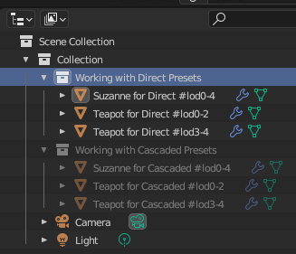

# Focus Wizard Tutorial

It's so good to know you are still interested in this add-on. Keep it up! You'll soon master effective lodding. For now, you can find a Blender file called [Monkey-with-Teapot.blend](./Monkey-with-Teapot.blend) in this folder. Open it in Blender and read this guide to get a practical example of using the built-in presets.

As discussed in the [User Guide](../README.md), **T1nk-R Focus Wizard** is shipped with two sets of presets, called the Direct presets and the Cascaded presets. As also explained, the two only differs in how modifiers shall be composed for logging.

The Blender file has two collections, **Working with Direct Presets** and **Working with Cascaded Presets**. You are more than encouraged to try what is written here, and you can also test what results you get by applying the other set of presets. This may help in understanding how things go.

## Enable **T1nk-R Focus Wizard**

To get up and running:

1. If you haven't done so, head to [https://github.com/gusztavj/Focus-Wizard](https://github.com/gusztavj/Focus-Wizard) and download the latest version of the add-on.
1. [Install the add-on](https://docs.blender.org/manual/en/latest/editors/preferences/addons.html#installing-add-ons).
1. [Enable the add-on](https://docs.blender.org/manual/en/latest/editors/preferences/addons.html#enabling-disabling-add-ons)
1. Load the Blender file and feel free to look around.

In both examples, we have a scene with a monkey and a teapot, and we want to create 4 additional lod levels. You'll learn how easy it is to view each lod with this add-on.

## Working with Direct Presets

Now you'll work with the collection named **Working with Direct Presets**.

First of all, hide all other collections and set the scope of **T1nk-R Focus Wizard** to this collection to make sure the visibility of objects outside this collection is not affected. To select the scope:

1. Click the icon or anywhere in the **Root Collection** field.
1. Select **Working with Direct Presets**.

||
|:--:|
|_Select scope_|

The collection contains 3 objects, a monkey and two teacups, each tagged, as shown below:

||
|:--:|
|_A screenshot of the example file with object names shown in the Outliner_|

### The Monkey for Direct Presets

The tag `#lod0-4` in the name of **Suzanne for Direct #lod0-4** means we plan to use this Blender object for all lod levels. If you open a **Properties** editor and switch to **Modifiers**, you'll see the following:

||
|:--:|
|_Modifiers defined for the monkey_|

The idea here is that we create a separate **Subdivision** modifier for lod 0, 1 and 2, and a **Decimate** modifier for lod 4. Subdivision modifiers refine geometry differently, the higher the level of details, the higher **Levels Viewport** is. The **Decimate** modifier will reduce geometry. The base mesh without any modifiers applied (the monkey as it was created) belongs to lod 3. That is, for lod 3 we don't need any modifiers, and that's exactly why you can't notice any modifiers tagged with `#lod3`.

Before you learn how to set up your stuff to work like charm, first take a look at this short demo to find out what ease of switching you can gain.

https://github.com/gusztavj/Focus-Wizard/assets/12009110/52c55d88-da66-429c-b061-b6850398fc3d

#### How Modifier Rules for Direct Presets Work

* When you switch to **Direct: Lod 0** in **Select Preset** of **T1nk-R Focus Wizard**, the `Subdivision #lod0` modifier will be made visible and the others will be hidden.

    ||
    |:--:|
    |_Only the `#lod0` modifier is visible_|

    Take a look at the objects themselves and you'll find the most detailed version there.

* When you switch to **Direct: Lod 1** in **Select Preset** of **T1nk-R Focus Wizard**, the `Subdivision #lod1` modifier will be made visible and the others will be hidden.

    Take a look at the objects, again, and you'll find a less-detailed version:

    ||
    |:--:|
    |_Difference in details between lod 0 and lod 1_|

* When you switch to **Direct: Lod 2** in **Select Preset** of **T1nk-R Focus Wizard**, the `Subdivision #lod2` modifier will be made visible and the others will be hidden.

* When you switch to **Direct: Lod 3** in **Select Preset** of **T1nk-R Focus Wizard**, no modifiers will be shown for the object. If you take a look at the **Selected Preset** section after switching to this preset and take a look at the value of **Modifiers to hide**, you'll notice the following rule: `#lod[01245]$|#lod.*-[012]|#lod[4]-`.

    ||
    |:--:|
    |_Check the **Modifiers to Hide** rule of the current preset_|

    The first part, `#lod[01245]$` means that if the name contains `#lodn` where `n` is either 0, 1, 2, 4 or 5, the modifier will be hidden. All of the modifiers match this rule, therefore all will be hidden.
  
* When you switch to **Direct: Lod 4** in **Select Preset** of **T1nk-R Focus Wizard**, the `Decimate #lod4` modifier will be made visible and the others will be hidden.
  
### The Teapot for Direct Presets

Teapot is elaborated a bit further to show you an example where you want to manually intervene to topology reduction at some point instead of pushing sliders of modifiers all the way down or up. Look both objects separately by turning their visibility on an off. The idea is that from lod 3 we don't need the handle of the pot, the lip and the handle of the potlid, assuming that they won't be noticeable from that distance, and therefore we can reduce their geometry to 0 triangles by simply removing them.

This is example shows that you have one object representing the same part of your scene or model for some lod levels, and another for other lod levels. Hence the names, **Teapot for Direct #lod0-2** indicates this object will be shown for lod 0, lod 1 and lod 2, while **Teapot for Direct #lod3-4** will be shown for lod 3 and lod 4.

If you take a look at the **Objects to show by name** and **Objects to hide by name** rules of, for example, the **Direct: Lod 1** preset, you'll see that:

* **Teapot for Direct #lod0-2** matches the **Objects to show by name** rule `#lod.*1|#lod0-`, namely the `#lod0-` part, and this will make the object visible.
* **Teapot for Direct #lod3-4** does _NOT_ match the **Objects to show by name** rule `#lod.*1|#lod0-`, as it neither contains `1`, nor starts with `#lod0-`, and this will _NOT_ make the object visible. (In itself, this rule won't make it invisible if it would be visible for any reason.)
* **Teapot for Direct #lod0-2** does _NOT_ match the **Objects to hide by name** rule `#lod[02345]$|#lod[234]-`, as the character after `#lod` is not `0`, `2`, `3`, `4` or `5` (but `1`), therefore this rule will _NOT_ make the object hidden.
* **Teapot for Direct #lod3-4** matches the **Objects to hide by name** rule `#lod[02345]$|#lod[234]-`, as the character after `#lod` is not `3`, therefore this rule will make the object hidden.
* At the end, **Teapot for Direct #lod0-2** will be visible for preset **Direct: Lod 1**, while **Teapot for Direct #lod3-4** will be hidden.

For the two teapots, we use similar techniques than for the monkey:

* **Teapot for Direct #lod0-2** has two modifiers, one refining the base geometry for lod 0, and another reducing geometry for lod 2. For lod 1, we'll use the object as it was created, with no refining, no reduction of topology.
* **Teapot for Direct #lod3-4** has two modifiers, one applied in all cases (not matching any hiding rules). Having such a modifier is not mandatory. The reason we added is that we could reduce the geometry of what remained from the teapot further without significant changes in its shape. The other modifier added to this object will be shown for lod 4, yielding in basically the outline of the pot.

## Working with Cascaded Presets

Now you'll work with the collection named **Working with Cascaded Presets**.

First of all, hide all other collections and set the scope of **T1nk-R Focus Wizard** to this collection to make sure the visibility of objects outside this collection is not affected. To select the scope:

1. Click the icon or anywhere in the **Root Collection** field.
1. Select **Working with Direct Presets**.

||
|:--:|
|_Select scope_|

The collection contains 3 objects, a monkey and two teacups, each tagged, as shown below:

||
|:--:|
|_A screenshot of the example file with object names shown in the Outliner_|

### The Monkey for Cascaded Presets

The tag `#lod0-4` in the name of **Suzanne for Direct #lod0-4** means we plan to use this Blender object for all lod levels. If you open a **Properties** editor and switch to **Modifiers**, you'll see the following:

||
|:--:|
|_Modifiers defined for the monkey_|

This is how cascading is different from the other technique. Now we want to combine the effects of modifiers. You can notice that we have an initial **Subdivision** operator to refine default topology for lod 0, and then we add a **Decimate** operator for each lod level from 1 to 4. Each **Decimate** decreases geometry to some degree, and their effects is combined: if you switch to lod 3, for example, **Subdivision (base)**, **Decimate #lod1** (with un-subdivision of 3 iterations), **Decimate #lod2** (with un-subdivision of 2 iterations) and **Decimate #lod3** (with un-subdivision of 2 iterations) will all be shown, meaning that you apply a decimation of un-subdivision with 3 + 2 + 2 = 7 iterations.

#### How Modifier Rules for Cascaded Presets Work

* When you switch to **Cascaded: Lod 0** in **Select Preset** of **T1nk-R Focus Wizard**, the `Subdivision (base)` modifier will be made visible and the others will be hidden, as there is no rule for showing modifiers defined (which means all modifiers shall be visible initially), and `Subdivision (base)` does not match the hiding rule (it doesn't even contain the string `lod`), while all other modifiers match the hiding rule (the first part of it).

* When you switch to **Cascaded: Lod 1** in **Select Preset** of **T1nk-R Focus Wizard**, the `Subdivision (base)` and the `Decimate #lod1` modifier will be made visible and the others will be hidden as all other match the modifier hiding rule.

* When you switch to **Cascaded: Lod 2** in **Select Preset** of **T1nk-R Focus Wizard**, the `Subdivision (base)`, the `Decimate #lod1` and the `Decimate #lod2` modifier will be made visible and the others will be hidden.

  This is where you can first notice easily that the effects of the two modifiers are combined. Having this preset set, feel free to show/hide `Decimate #lod1` to see the changes.

    ||
    |:--:|
    |_Cascaded modifiers and the effect of turning off the lod1 modifier_|

  If you turn off the modifier for lod1, the object's geometry won't be reduced that much.

* When you switch to **Cascaded: Lod 3** in **Select Preset** of **T1nk-R Focus Wizard**, `Subdivision (base)` and the `#lod1`, `#lod2` and `#lod3` modifiers will all be applied.
  
* When you switch to **Cascaded: Lod 4** in **Select Preset** of **T1nk-R Focus Wizard**, all modifiers will be applied.
  
### The Teapot for Cascaded Presets

To make the long story short, construction of the teapot is very similar to how we constructed it for the direct preset. The key difference is that we have added a **Decimate #lod1** modifier to **Subdivision #lod0** and **Decimate #lod2** modifiers for **Teapot for Direct #lod0-2**, and changed some modifier parameters.

* For lod 0 to 2, **Teapot for Direct #lod0-2** will be shown, with the `#lod0` modifier shown for lod 0, the `#lod0` and `#lod1` shown for lod 1, and the `#lod0`, `#lod1` and `#lod2` modifiers shown for lod 2.

* For lod 3 and 4, **Teapot for Cascaded #lod3-4** is gonna be shown with **Decimate (base)** displayed for lod 3, and both displayed for lod 4.
