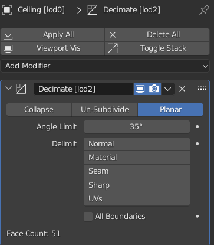
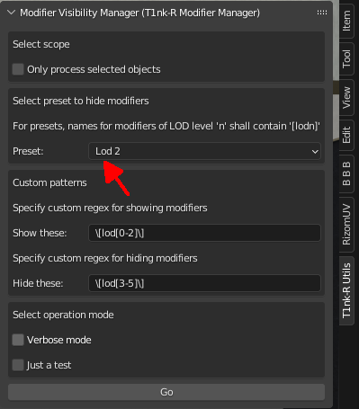

# Modifier Visibility Manager

Created by [T1nk-R](https://github.com/gusztavj/).

Version 1.0 @ 2023-12-06

New versions, support, feature requests, saying Hi: [https://github.com/gusztavj/Modifier-Manager](https://github.com/gusztavj/Modifier-Manager)

## Copyright

Creative Commons CC-BY-SA. Simply to put, you can create derivative works based on this script, and if you are nice, you don't remove the following attribution:
> Original script created by: T1nk-R - [na.mondhatod@gmail.com](mailto:na.mondhatod@gmail.com)

## Disclaimer

This script is provided as-is. Use at your own risk. No warranties, no guarantee, no liability, no matter what happens. Still I tried to make sure no weird things happen.

## What Is This?

This add-on displays a Modifier Visibility panel in Blender allowing you to specify which modifiers to show or hide. Showing or hiding a modifier means showing or hiding its effect in the viewport.

You can tell whether you want the add-on to process all your Blender objects in your current scene's current view layer, or only the selected ones. This is called the _scope_.

You can specify a show and a hide regex pattern:

* If the name of a modifier added to an object in the scope matches the _show_ pattern, it will be _shown_.
* If the name of a modifier added to an object in the scope matches the _hide_ pattern, it will be made _hidden_.

Presets help you be quick.

## Key Scenario

While you can use the add-on to your will, the idea came when I wanted to create various LOD levels of my asset only by adding modifiers to objects. Having a lot of objects and lod levels, it became a bit awkward to select objects and select which modifiers to show when I wanted to see how the object looks at lod1 or lod2, for example.

The idea was to include a tag like \[lod0\], \[lod1\] and so on at the end of modifier names. The following shows an example of a modifier that I want to apply only when I want to see or export the LOD2 version of my asset:

You just simply click the name (_Decimate_ in the example) and type `[lod2]`.

Not only setting up the modifiers this way for dozens of objects takes time, but when you want to view your asset in LOD2.

This is when the add-on can help: just select LOD 2 from the **Preset** combo box, and the add-on will:

* Show all modifiers with a tag `[lod0]`, `[lod1]` and `[lod2]`, as these all shall be applied to get the LOD2 version.
* Hide all modifiers with a tag `[lod3]`, `[lod4]` and `[lod5]`, as none of these shall be visible, as they belong to higher levels.

## Reference

The following settings are offered:

* **Only process selected objects**. When checked, only selected objects will be processed, otherwise all objects in the view layer of the current scene.
* **Preset**. A couple of presets to quickly set show and hide patterns based on the key scenario, and to quickly set patterns to show or hide all modifiers.
  * Select **All** to show all modifiers.
  * Select **None** to hide all modifiers.
* **Show these**. A regular expression. If the name of a modifier added to an object matches this pattern, the modifier will be _shown_. If **Only process selected objects** is checked, only selected objects will be processed.
* **Hide these**. A regular expression. If the name of a modifier added to an object matches this pattern, the modifier will be _hidden_. If **Only process selected objects** is checked, only selected objects will be processed.
* **Verbose mode**. When checked, the log in the **System Console** will detail what is happening. For example it will list all objects in the scope and all modifiers processed. Otherwise the log will only list changes made.
* **Just a test**. When checked, nothing will actually happen. Open the **System Console** and learn the effects of your settings before actually applying them.
* **Go**. If you change a preset, modifier visibility is changed accordingly. However if you edit the patterns, you have to click Go to perform the configured changes.
