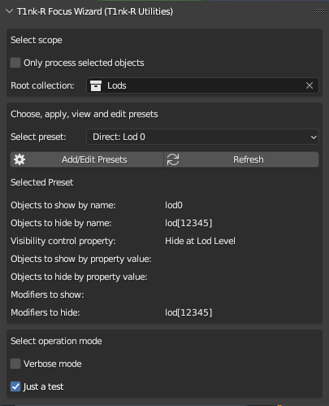
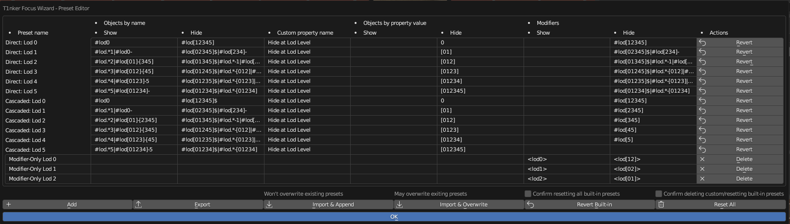

# T1nk-R Focus Wizard add on for Blender

Part of **T1nk-R Utilities for Blender**

## TL;DR

You can use this add-on to create presets in the form of a set of rules:

* to control the visibility of Blender objects based on object name patterns and custom object property value patterns, as well as
* to control the visibility of object modifiers based on modifier name patterns.

With this add-on you can set up rules to easily view your model as it looks like at various LOD levels by showing respective objects and modifier effects and hiding others.

You need Blender 3.6 or newer for this addon to work.

Help, support, updates and anything else: [https://github.com/gusztavj/Modifier-Manager](https://github.com/gusztavj/Modifier-Manager)

## Legal Stuff

### Copyright

**Creative Commons CC BY-NC-SA:**

* This license enables re-users to distribute, remix, adapt, and build upon the material in any medium or format for noncommercial purposes only, and only so long as attribution is given to the creator.
* If you remix, adapt, or build upon the material, you must license the modified material under identical terms.

* CC BY-NC-SA includes the following elements:

  * BY: credit must be given to the creator.

    Credit text:
    > Original addon created by: T1nk-R - [janvari.gusztav@imprestige.biz](mailto:janvari.gusztav@imprestige.biz) / [https://github.com/gusztavj](https://github.com/gusztavj)

  * NC: Only noncommercial uses of the work are permitted.
  * SA: Adaptations must be shared under the same terms.

**For commercial use**, please contact me via [janvari.gusztav@imprestige.biz](janvari.gusztav@imprestige.biz). Don't be scared of
rigid contracts and high prices, above all I just want to know if this work is of your interest, and discuss options for commercial support and other services you may need.

Version: Please see the `version` tag under `bl_info` in `__init__.py`.

### Disclaimer

This add-on is provided as-is. Use at your own risk. No warranties, no guarantee, no liability, no matter what happens. Still I tried to make sure no weird things happen:

* This add-on is intended to show or hide objects under the collection you specified as the scope of operation.
* This add-on is intended to show or hide modifier effects of objects under the collection you specified as the scope of operation.
* This add-on is not intended to modify your objects and other Blender assets in any other way. In particular, this add-on is not intended to anyhow touch objects out of the scope you selected as the scope of operation.
* You shall be able to simply undo consequences made by this add-on.
* You can use this add-on to save your presets in JSON format to a file on your computer.
* You can use this add-on to load presets from a JSON file on your computer.

You may learn more about legal matters on page [https://github.com/gusztavj/Modifier-Manager](https://github.com/gusztavj/Modifier-Manager)

## Usage and Help

### Key Scenarios

When creating assets for games, you often need to take care of various versions of your model for various detail levels, called LOD (level of details). The most detailed version is usually called lod0, while lod1, lod2 etc. are each less detailed.

There are multiple approaches on how to create these less detailed versions. Common to many is, however, that for moderately and largely complex models, it may be cumbersome, time-consuming and error-prone to display your model as it looks at a specific lod level:

* If you apply object modifiers to decimate your objects, to switch lod levels, you may need to select each of your objects one by one and set the visibility of the effects of the modifiers in the viewport carefully.
* If you create copies of your objects, it may also be time-consuming to find which ones to display and which ones to hide, especially if there are some objects that would be great for multiple lod levels.

This add-on can help turning this nightmare into a seamless experience by offering (and letting you create) presets defining what to display. Presets include rules 

* to specify which objects to show or hide
  * based on object name patterns and
  * value patterns of custom object properties, and
* to specify which object modifiers to show/hide in the viewport based on the name pattern of modifiers.

#### Quick Examples

##### Quick Example 1

For example, if you tag your modifiers to include the lod level for which to apply it in the form of `[lodx]` (with _x_ going from 0 to e.g. 4), you can specify a preset for LOD 3 which shows all modifiers the name of which contain `[lod3]` and hide all others.

||
|:--:|
|_Modifiers tagged to indicate for which LOD you want to use them_|

##### Quick Example 2

Another example is if you tag your objects the same way. You can then specify a preset for LOD 2 to show only objects with `[lod2]` in the name.

||
|:--:|
|_Objects tagged to indicate for which LOD you want to use them_|

### Using T1NK-R Focus Wizard

To make use of this add-on, you have to do some homework: you either need to learn about the built-in presets and adjust your modeling techniques to make use of them, or you need to learn about creating presets and create them to reflect how you manage your stuff. Learning may take some time and experimenting, however it will pay off: you'll be able to switch between various views with a single click. If you are even now able to switch between views of various LOD levels, please let me know, I'm interested in your modeling techniques and lod development pipeline.

Don't be too scared now, to make a preset you only need to compose a few not too complex regular expressions (regex). You can always use the built-in ones as guides and hints.

Next you have to tag your objects and modifiers properly. How to tag them depends on the presets you use or create.

To get started, open the **Sidebar** (hit **N**) in **Object Mode** in the viewport after you enabled the add-on. You'll see something like this:

||
|:--:|
|_Screenshot of the main panel of the add-on_|

The main panel of the Focus Wizard is divided into the following sections:

* In the top section you can [select the scope of your operations](#scope-selector).
* In the [middle section](#preset-selector-and-info) you can select a preset, view it's conditions, as well as access the [Preset Editor](#preset-editor) window.
* By the end you can set various [operation parameters](#operation-settings).

Once properly set up and got used to it, most of the time you will only switch between presets.

### Presets

Presets, sets of rules, describe what objects you want to be make visible and which objects you want to make hidden, as well as which modifiers to make visible or hidden.

#### Anatomy of Presets

A preset is a set of rules and some accompanying properties:

* **Preset Name** is the unique name and identifier of the preset.
  > Make sure preset names are unique as they serve as the keys of presets, too. If you have two presets by the same name, it is undefined which one will be in effect.

* **Built-In** (not directly visible) tells whether it's a built-in effect or not. You cannot edit the name of built-in presets and cannot delete built-in presets.

* **Objects by name** group of rules
  
  * **Show Objects by Name**. A regex pattern. Objects with names matching this regex will be made **visible**. 
    * If the regex is empty, all objects (within the scope) will be made visible.
  
  * **Hide Objects by Name**. A regex pattern. Objects with names matching this regex will be made **hidden**.
    * If the regex is empty, this rule won't make any objects hidden.

* **Objects by property value** group of rules
  
  * **Custom Property Name**. The name of a custom object property. If you define a pattern for **Show Objects by Property Value** or **Hide Objects by Property Value**, the add-on will check the value of the property you specified here.
  
  * **Show Objects by Property Value**. A regex pattern. Objects to which the specified custom object property has been added with a value matching this regex will be made **visible**.
    * If the regex is empty, this rule won't have any effect.
  
  * **Hide Objects by Property Value**. A regex pattern. Objects to which the specified custom object property has been added with a value matching this regex will be made **hidden**.
    * If the regex is empty, this rule won't have any effect.

* **Modifiers** group of rules
  
  * **Modifiers to Show.** A regex pattern. Only objects made visible by the **Objects by name** or **Objects by property value** group of rules rules will be considered. If the name of a modifier matches this regex, that modifier will be made **visible** in the viewport.
    * If the regex is empty, this rule won't have any effect.
  
  * **Modifiers to Hide.** A regex pattern. Only objects made visible by the **Objects by name** or **Objects by property value** group of rules rules will be considered. If the name of a modifier matches this regex, that modifier will be made **hidden** in the viewport.
    * If the regex is empty, this rule won't have any effect.

Notes:

* Before starting evaluating the rules, all objects in the scope are made hidden. This gives a chance for a clean start in an effort for a repeatable experience.
* Rules are applied in the order listed above.
* If you hide an object by name, you can make it visible by custom property value.
* You only need to specify a regex if you want to control something. If you, for example, don't use custom object properties for this purpose, you don't need to define rules for them.

#### Rules based on custom object properties

As described below, you can control object visibility based on custom object properties. This enables you to follow a scenario where you add a specific custom object property to objects that you want to hide or display at certain LOD levels.

For example you can create a custom object property called `Hide at LOD Level` and for each object specify a value if you want to hide it on or below certain lod levels. If you have smaller objects, for example, those may not be required at a certain lod level. For example, if you plan to have four lod levels from lod0 to lod3 and you find that a small object would anyway be invisible on lod2 and lod3, you can further reduce the number of polygons by not including it in the lod2 and lod3 asset version. Now you can specify `2` or `23` as the value for `Hide at LOD Level`, and create appropriate rules:

* If you follow an incremental approach, you can specify `2` and interpret it that the object shall not be included in the model _on and below_ lod2. Then you can:
  * Create a custom preset called `My Lod 2` with the following values:
    * **Custom Property Name** = `Hide at LOD Level`
    * **Show Objects by Property Value** = empty to show all objects regardless of the value of this property
    * * **Hide Objects by Property Value** = `2`

    This will hide all objects where the value of the custom object property is `2`.

  * Create a custom preset called `My Lod 3` with the following values:
    * **Custom Property Name** = `Hide at LOD Level`
    * **Show Objects by Property Value** = empty to show all objects regardless of the value of this property
    * * **Hide Objects by Property Value** = `[23]`

    This will hide all objects where the value of the custom object property is `2` or `3`.

* If you follow an direct approach, you can specify `2` and interpret it that the object shall not be included in the model _on_ lod2. Then you can:
  * Create a custom preset called `My Lod 2` with the following values:
    * **Custom Property Name** = `Hide at LOD Level`
    * **Show Objects by Property Value** = empty to show all objects regardless of the value of this property
    * * **Hide Objects by Property Value** = `2`

    This will hide all objects where the value of the custom object property is `2`.

  * Create a custom preset called `My Lod 3` with the following values:
    * **Custom Property Name** = `Hide at LOD Level`
    * **Show Objects by Property Value** = empty to show all objects regardless of the value of this property
    * * **Hide Objects by Property Value** = `3`

    This will hide all objects where the value of the custom object property is `3`. It will not hide the object at lod level `2`.

#### Built-In Presets

Built-in presets are provided for a few scenarios:

> TBD

#### Create Custom Preset

You can simply [create custom presets](#bottom-button-bar).

#### Sharing Presets

* You can [export your presets](#bottom-button-bar) to a JSON file to import it into other Blender files or to share with others.

* You can [import](#bottom-button-bar) presets you exported, or someone else exported and shared with you.

### Reference

#### T1NK-R Focus Wizard Panel

The main panel of the add-on can be displayed by displaying the **Sidebar** in object mode. 

||
|:--:|
|_Screenshot of the main panel of the add-on_|

The main panel of the Focus Wizard is divided into the following sections:

* In the top section you can [select the scope of your operations](#scope-selector).
* In the [middle section](#preset-selector-and-info) you can select a preset, view it's conditions, as well as access the [Preset Editor](#preset-editor) window.
* By the end you can set various [operation parameters](#operation-settings).

##### Scope Selector

In the **Select scope** section you have the following options:

* **Only process selected objects.** Restrict the scope to selected objects only. Objects not selected at the moment of clicking Select Preset or Refresh won't be processed and touched by the add-on. This may be used for testing purposes. For example you can check how your LOD2 model looks like with a LOD3 object to see if you can simplify your object further for LOD2.
* **Root collection.** The base scope of your operation which you can restrict further with the checkbox. When doing its work, the add-on will only process and consider objects in and below this collection. If you have, for example, helper and template objects, you can move them out of the collection containing your "real" objects, and the add-on won't touch them ever.

  > Note that for the sake of safety you **need** to choose a collection or the operations will fail. You can choose the topmost collection just as any other, but you have to do this explicitly to avoid accidental changes to visibility.

##### Preset Selector and Info

The following settings are offered:

* **Select preset**. Select and apply a preset. To reapply a preset, open the drop-down and select it again.
* **Add/Edit Presets**. Open the [Preset Editor](#preset-editor) where you can edit, add, delete, revert, reload, import and export presets.
* **Selected Preset**. This section displays the conditions of the selected preset so that you don't need to open Preset Editor to get a quick view of what is expected to be visible and hidden.

#### Preset Editor

This is where you can edit, add, delete, revert, reload, import and export presets.

||
|:--:|
|_Screenshot of the **Preset Editor**_|

##### The Table of Presets

This grid displays all your presets, including built-in and custom presets, and allows you to edit them.

Notes:

* You cannot change the name of built-in presets.
* Make sure preset names are unique as they serve as the keys of presets, too. If you have two presets by the same name, it is undefined which one will be in effect.
* You don't need to save changes. Anything you do is saved automatically.
* Undo is also available fpr editing presets. If you think you made a mistake, just hit some **Undo** in Blender's **Edit** menu.

**Columns:**

* For the meaning of the columns, please see the [anatomy of presets](#anatomy-of-presets).
* **Actions** column. Based on the type of the preset (built-in or custom), you can perform certain operations on a preset:
  * **Revert.** Available only for built-in presets, you can revert the preset to the factory state. You can edit and experiment with built-in presets and if you feel you got lost, feel free to revert it.
  * **Delete.** Available only for custom presets, you can delete the given preset.

##### Bottom Button Bar

This bar includes a few buttons as follows:

* **Add.**. Create a new custom preset. You can create as many as you want. Make sure to set a unique name, though.

* **Export.** Export all presets, including built-in ones, to a JSON file in your computer. Once clicking the button, a small dialog opens where you can browse where to save the file. 
  
  Please note that after you select a file, the window may accidentally be closed. In this case just hit **Export** again, and the file will be there, and you will only need to click **Save**.

* **Import & Append.** Import presets from a JSON file. If there is a preset in the file with the same name as one of your existing presets, your copy won't be changed, and the copy from the file will not be imported.

  Please note that after you select a file, the window may accidentally be closed. In this case just hit **Import & Append** again, and the file will be there, and you will only need to click **Load**.

* **Import & Overwrite.** Import presets from a JSON file. If there is a preset in the file with the same name as one of your existing presets, your copy will be replaced with the one found in the file.

  Please note that after you select a file, the window may accidentally be closed. In this case just hit **Import & Overwrite** again, and the file will be there, and you will only need to click **Load**.

* **Revert Built-in.** Click to revert all built-in presets to factory state. If you edited them and got lost, you can restore the original conditions.
  * Before clicking the button, check **Confirm resetting all built-in presets** to confirm your intent. This is to prevent accidental clicks.

* **Reset All.** Click to delete all custom presets and revert all built-in presets to factory state.
  * Before clicking the button, check **Confirm deleting custom/resetting built-in presets** to confirm your intent. This is to prevent accidental clicks.

### Operation Settings

* **Verbose mode**. When checked, the log in the **System Console** will detail what is happening. For example it will list all objects in the scope and all modifiers processed.
* **Just a test**. When checked, nothing will actually happen. Open the **System Console** and learn the effects of your settings before actually applying them.
